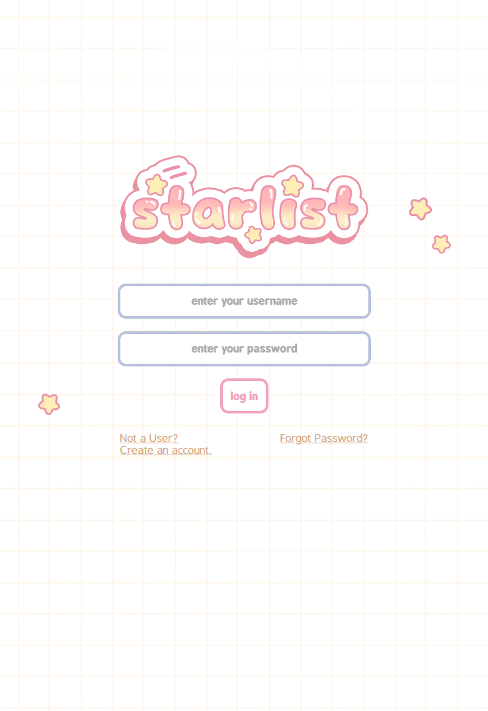
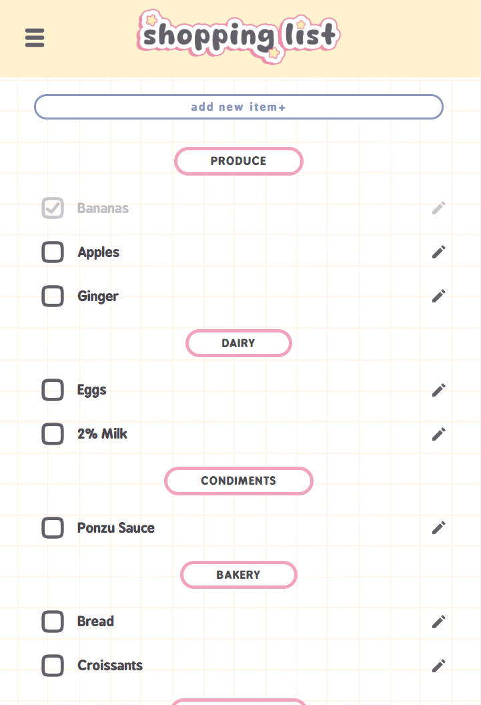
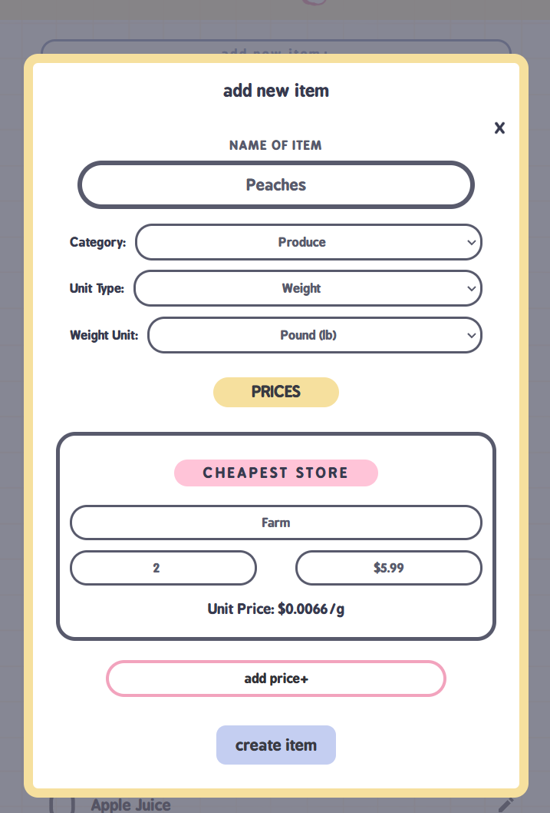
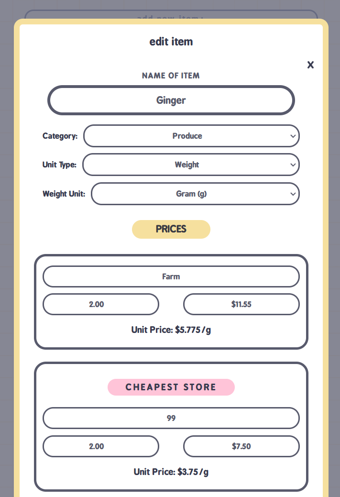

# starlist 

Starlist is an app designed to help shoppers create a shopping list while also providing comparisons of unit prices across various stores. Its primary goal is to determine which store offers the lowest unit price for each item.

 

### ☆ ───── Features ───── ☆
 
☆ Shopping List Creation: Easily add and manage items on your shopping list.   
☆ Price Comparison: Automatically compare unit prices from various stores to find the best deals.  
☆ User-Friendly Interface: Navigate through a clean and modern design.  

 

### ☆ ───── Technologies ───── ☆
 
☆ HTML  
☆ CSS  
☆ Javascript  
☆ PHP  
☆ mySQL  
  

### ☆ ───── Screenshots ───── ☆

  

 

    
    
    
    
    

  

### ☆ ───── Future enhancements ───── ☆

  
☆ Multiple Lists   
