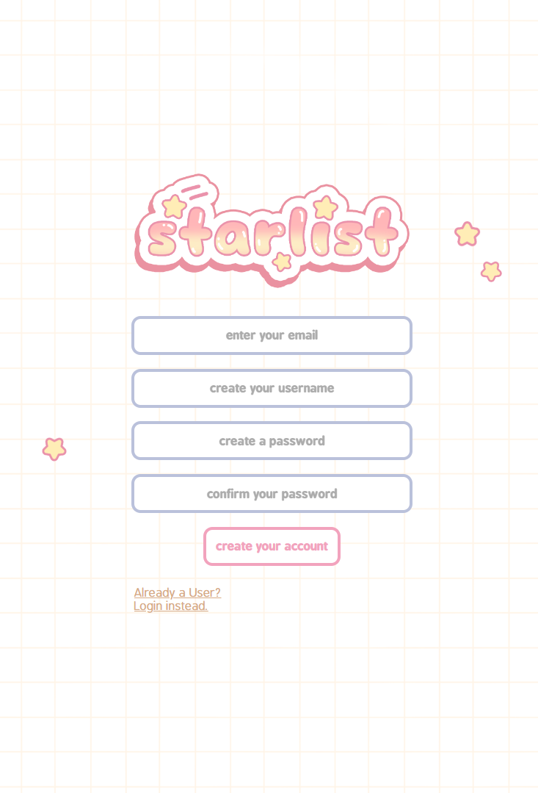

# starlist 

Starlist is an app designed to help shoppers create a shopping list while also providing comparisons of unit prices across various stores. Its primary goal is to determine which store offers the lowest unit price for each item.

-------- PROJECT CURRENTLY IN PROGRESS -------- 

 

### ☆ ───── Technologies ───── ☆
@@ -26,25 +24,21 @@ Starlist is an app designed to help shoppers create a shopping list while also p
☆ Password encryption 
  

<!--
### ☆ ───── Screenshots ───── ☆

  

 

    
    
    
    
    
    
    
    
    
    
    

  

### ☆ ───── Future enhancements ───── ☆

  
☆ Online function  
☆ Mass edit cards  
 -->
☆ Multiple Lists   
